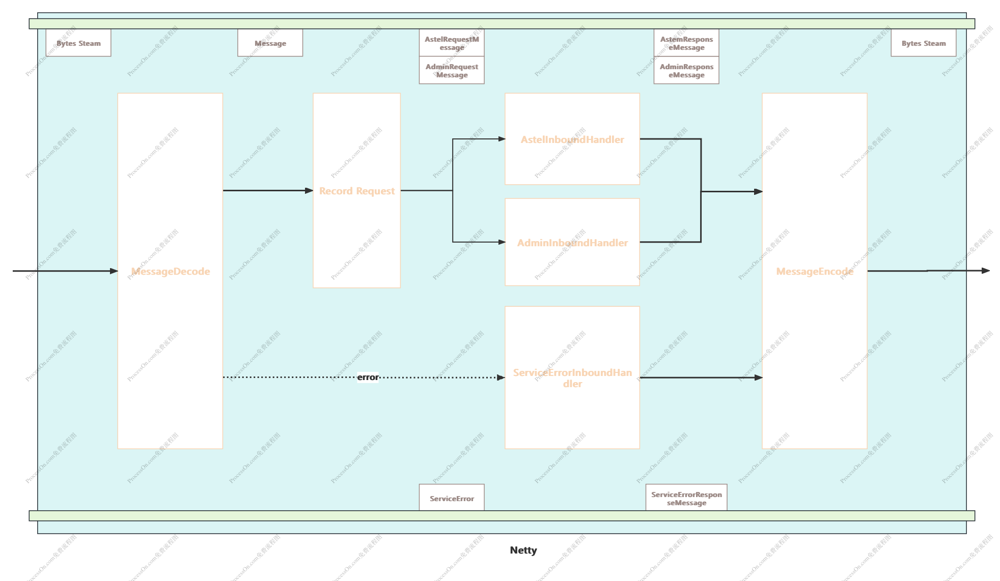

# Astel

Astel is an in-memory Key Value (KV) Database (like Redis) that persists on disk.
The data model is key-value, but many different kind of values are supported: `Strings`, `Lists`, `Sets`..

Use netty as the network layer framework and custom message protocol.



## Features

- Multi Structures
    - Strings
    - Lists
    - Sets
    - Hash
- Memory Clean
    - Scheduled eviction
    - Passive eviction
- Persistent
    - Snapshot(RDB)
- Single thread Execution

## Commands

- set
- get
- del
- exists
- expire
- ttl
- lpush
- rpush
- lpop
- rpop
- llen
- lrange

## Server Run

```shell
gradle build -x test
# Modify the config file: resources/config.yaml
java -jar Astel.jar
```
